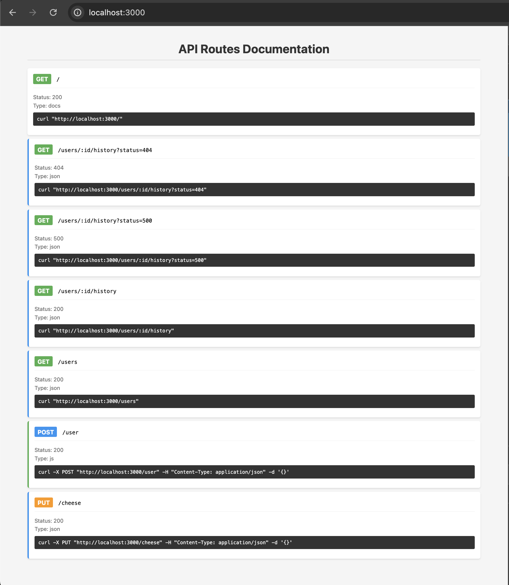

# LocalServe

## Alpha status - expect breaking changes

A lightweight development server for quickly mocking API endpoints and testing HTTP requests.


## Quick Start

1. Create a `/routes` folder in any directory

```bash
mkdir routes
cd routes
```

2. Add .json or .js files in the `/routes` directory

```js
// routes/get-users-:id-profile.json
{ "username": "Test", "age": 42 }


// routes/put-users-:id.js
module.exports = (req, res) => {
  res.status(201).json({
    message: `User ${req.param.id} updated`,
  });
};
```

3. From the root directory (parent of `/routes`)

```bash
npx localserve [--port=3001] optional port
```

🎉 Now you have routes you can use for local development

GET http://localhost:3000/users/123/profile

PUT http://localhost:3000/users/123

## Features

- 📄 Automatic API documentation page
- ⏱️ Configurable response delays
- 🎯 Custom status codes

## Route Configuration

The route files's name is used to contruct the API path.

Rules

1. All `-` characters are converted to `/`.

2. The first word of the file name must be an HTTP verb.

3. An optionial valid HTTP response code can be appended to the end of the file name.

```js
get-users-:id-profile.json
GET /users/:id/profile
```

```js
put-users-:id-profile-500.json
PUT /users/:id/profile?status=500
```

### Basic Route Types

- `json`: Returns JSON in the file

```json
// routes/get-user.json
// must use valid JSON
{ "username": "Test", "age": 42 }
```

- `js`: Returns the result of the function in your JS file

```javascript
// Express.js req/res objects are passed into your function
// routes/put-user-:id.js
module.exports = (req, res) => {
  res.status(201).json({
    message: `User ${req.param.id} updated`,
  });
};
```

### Query Parameters

All endpoints support the following query parameters:

| Parameter | Description                                | Example       |
| --------- | ------------------------------------------ | ------------- |
| status    | Override response status code (100-599)    | `?status=404` |
| delay     | Delay response by milliseconds (max 60000) | `?delay=2000` |

### Examples

Add custom error/status code responses

```js
// routes/get-users-:id-profile.json
{ "username": "Test", "age": 42 }

// GET /users/:id/profile
return HTTP 200
{ "username": "Test", "age": 42 }

// routes/get-users-:id-profile-500.json
{ "myCustom500message": "oof, 500" }

// GET /users/:id/profile?status=500
returns HTTP 500
{ "myCustom500message": "oof, 500" }

```

If you dont want to create a custom status code file you can just use the `?status=${any valid status code}` query param

```js
// GET /users/:id/profile?status=304
// no /routes/get-users-:id-profile-304.json|js file exists
return HTTP 403
{"status": 403 }
```

## Documentation UI

LocalServe automatically generates documentation of your routes at the root URL (`http://locahost:3000`).

It includes:

- List of all available endpoints
- HTTP method and response type indicators
- Ready-to-use curl commands
- Copy-to-clipboard functionality



## License

MIT

## Todo

- [ ] add file upload multipart/form-data endpoint mocking
- [ ] add custom header mocking
- [ ] add demo video
- [ ] package for npm
