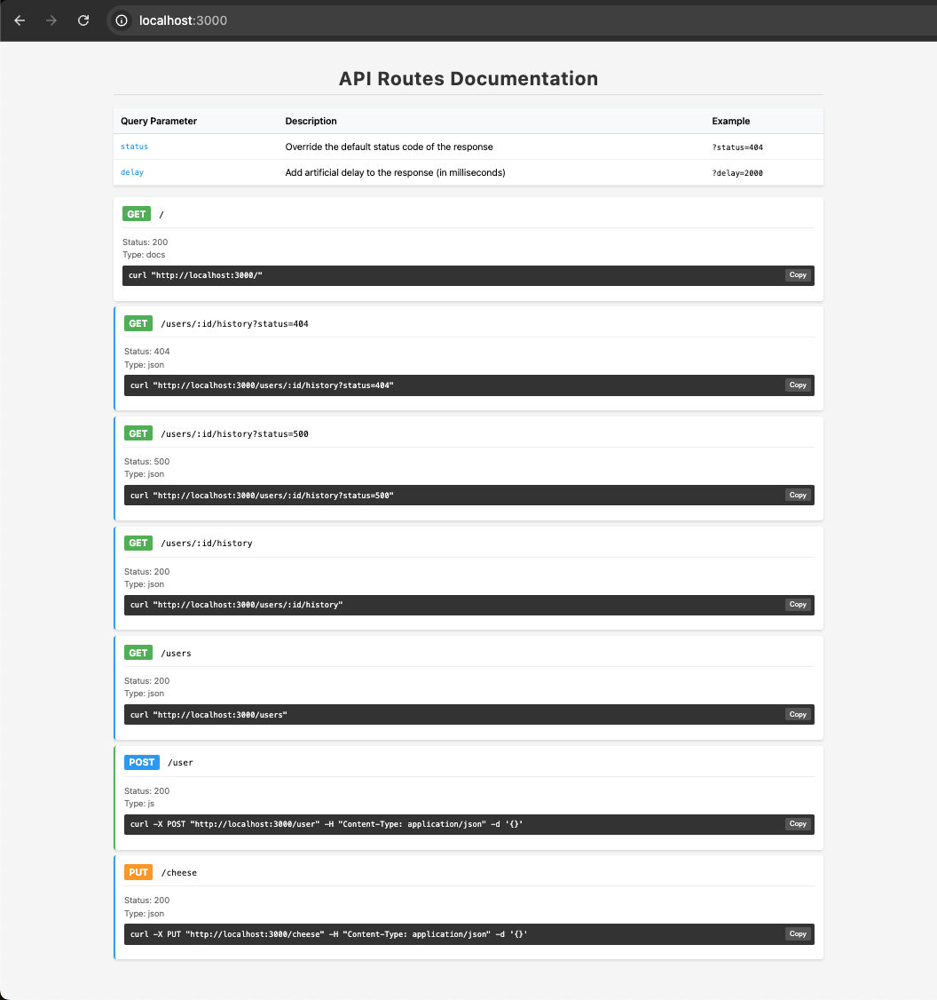

# LocalServe

## Alpha status - expect breaking changes

A dead-simple development server for quickly mocking API endpoints.

## Motivation

Sometimes you just need an endpoint to hit while developing locally. Instead of setting up MSW or remembering how Express.js works or using some online service you can now just make a `.json|.js` file and stub out different API scenarios for your current needs then `npx localserve`.

Fast, easy, and probably good enough until you get a real endpoint.

## Quick Start

1. Create .json or .js files

`get-users-:id-profile.json`

```js
{ "name": "Douglas Adams", "age": 42 }
```

or

`put-users-:id.js`

```js
module.exports = (req, res) => {
  res.status(201).json({
    message: `User ${req.param.id} updated`,
  });
};
```

2. From the same directory of your route files

```bash
npx localserve [--port=3001] optional port
```

🎉 Now you have routes you can use for local development

GET http://localhost:3000/users/123/profile

PUT http://localhost:3000/users/123

## Features

- 📄 Automatic API documentation page
- ⏱️ Configurable response delays
- 🎯 Custom status codes

## Route Configuration

The file name is used to construct the API path.

### Rules

#### 1. All `-` characters are converted to `/`.

`get-a-b-c.json` -> `GET localhost:3000/a/b/c`

#### 2. The first word of the file must be an HTTP verb

`get, post, put, patch, delete, options, head` (case insensitive)

#### 3. Path variables must use colons `:`

You can access these in `.js` files like so

`post-a-:foo-b-:bar.js`

```js
module.exports = (req, res) => {
  const foo = req.param.foo;
  const bar = req.param.bar;
  ...
};
```

#### 4. An optional valid HTTP response code can be appended to the end of the file name.

```js
get-users-:id-profile-403.json
GET /users/:id/profile?status=403
```

```js
put-users-:id-profile-500.json
PUT /users/:id/profile?status=500
```

### Basic Route Types

`json`: Returns the JSON in the file

```json
get-user.json

// must use valid JSON
{ "username": "Test", "age": 42 }
```

`js`: Returns the result of the function in your JS file

```javascript
put-user-:id.js

// Express.js req/res objects are passed into your function
module.exports = (req, res) => {
  res.status(201).json({
    message: `User ${req.param.id} updated`,
  });
};
```

### Query Parameters

All endpoints support the following query parameters(can be combined):

| Parameter | Description                                | Example       |
| --------- | ------------------------------------------ | ------------- |
| status    | Override response status code (100-599)    | `?status=404` |
| delay     | Delay response by milliseconds (max 60000) | `?delay=2000` |

### Examples

Add custom error/status code responses

```js
// GET /users/:id/profile
get-users-:id-profile.json
{ "username": "Test", "age": 42 }

return HTTP 200
{ "username": "Test", "age": 42 }

// GET /users/:id/profile?status=500
get-users-:id-profile-500.json
{ "myCustom500message": "oof, 500" }

returns HTTP 500
{ "myCustom500message": "oof, 500" }

```

If you dont want to create a custom status code file you can just use the `?status=${any valid status code}` query param

```js
// GET /users/:id/profile?status=403
// no get-users-:id-profile-403.json|js file exists
return HTTP 403
{"status": 403 }
```

## Documentation UI

LocalServe automatically generates documentation of your routes at the root URL (`http://locahost:3000`).

It includes:

- List of all available endpoints
- HTTP method and response type indicators
- Ready-to-use curl commands
- Copy-to-clipboard functionality



## Package development

clone/fork this repo and `npm install`

`chmod +x bin/cli.js` then `npm link` to be able to run `npx localserve` on a directory

or

create route files in a `/routes` folder at the root of this project (already .gitignored) and run `node src/index.js` or `npm start`

## Tests

`npm test`


## License

MIT

## Todo

- [ ] add file upload multipart/form-data endpoint mocking
- [ ] add custom header mocking
- [ ] add demo video
- [ ] package for npm
